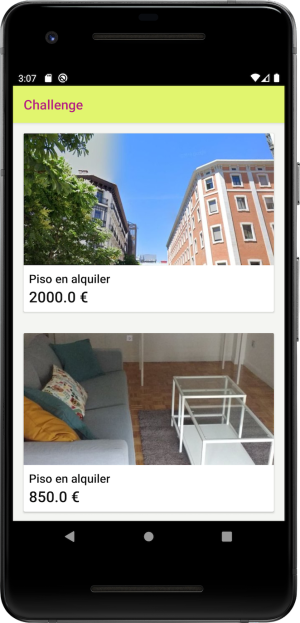

# idealista Android challenge
idealista Android crew needs you! We need a fellow to face our everyday challenges: new features, problem fixes, UI design, performance, security, backwards compatibility, testing...

This repository contains a project ready to work with, but we need your help to build next amazing features that will bring it to the next level, are you ready to go?

We love clean code and beautiful layouts, structured implementation and testable components, sounds good right... Does it sound good to you? This is your challenge!

## Getting started

This repository contains an Android app that retrieves a list of ads from idealista public API.

  

This is a multi-module project which contains three different modules: ``app``, ``core`` and ``list``. Application entry point is ``ListActivity`` located at ``list`` module

## Tasks 

Your task is to **clone** or **fork** this repository into one yours and take into consideration next steps

###### Before start
Damn it! It seems project has some kind of errors...could you help us to fix them and get project running great again before start?

###### New features to add

1. Go to an ad detail from ads list.
2. Favourite ads

###### Some optional tasks to do (bonus):

1. Some tests could be great idea
2. See ad images in some kind of ad gallery

###### Considerations
1. Deliver production ready code.
2. You can add any UX / UI improvements you consider

###### Once you've finished
1. Generate the application apk and place it into a distribution folder
2. Notify by email to rrhh@idealista.com which branch you want our Android team analyze
3. Have a beer after the work done